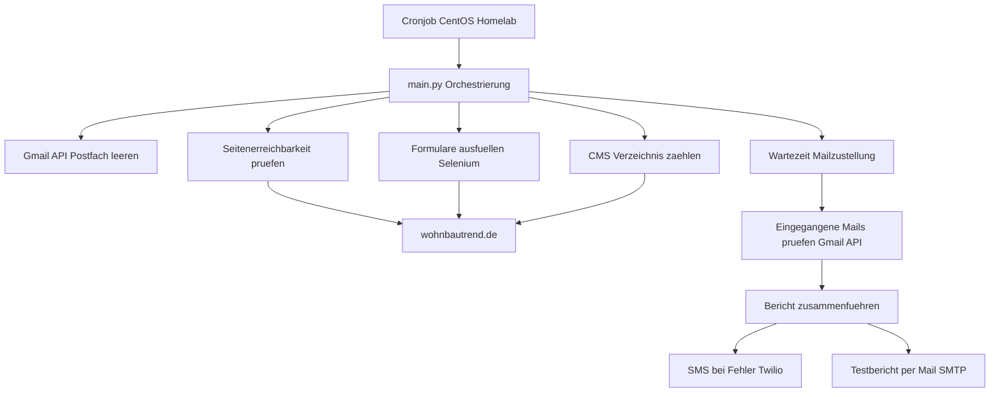

# Testsuite – Automatisiertes Monitoring für wohnbautrend.de

Eine automatisierte End-to-End-Testsuite, die die Funktionsfähigkeit einer Webflow-Kundenseite (wohnbautrend.de) überwacht. Die Suite prüft Seitenerreichbarkeit, füllt und versendet alle Formulare per Selenium, verifiziert die eingehenden Bestätigungsmails über die Gmail-API, prüft die Vollständigkeit des CMS-Verzeichnisses und versendet einen Testbericht per Mail sowie eine SMS-Warnung bei Fehlern.

Die Suite läuft autonom per Cronjob auf einem CentOS-Homelab, unabhängig vom Entwicklungsrechner.

---

## Funktionsumfang

- **Seitenerreichbarkeit**: HTTP-Statusprüfung aller Haupt- und Unterseiten
- **Formular-Tests**: Automatisches Ausfüllen und Absenden aller Formulare (Kontakt, Messetickets, Ausstelleranmeldung) via Selenium (headless)
- **Mail-Verifikation**: Prüfung über die Gmail-API, ob die erwarteten Bestätigungsmails eingegangen sind
- **CMS-Prüfung**: Abgleich der Anzahl der Verzeichniseinträge gegen einen Sollwert
- **Benachrichtigung**: Testbericht per E-Mail (SMTP), SMS-Alarm bei Fehlern (Twilio)
- **Autonomer Betrieb**: Geplante Ausführung per Cron auf dem Homelab

---
 
## Architektur



### Ablauf im Detail

1. **Postfach leeren** – Das Test-Postfach wird via Gmail-API geleert, damit nur frische Bestätigungsmails ausgewertet werden.
2. **Bericht zurücksetzen** – `Bericht.txt` wird geleert.
3. **Erreichbarkeit prüfen** – Alle Haupt- und Unterseiten werden per HTTP-Request auf Status 200 geprüft, das Ergebnis in den Bericht geschrieben.
4. **Formulare absenden** – Kontaktnachrichten (Aussteller/Besucher), Messetickets und Ausstelleranmeldungen werden per Selenium real ausgefüllt und abgeschickt.
5. **CMS prüfen** – Die Anzahl der Einträge im Ausstellerverzeichnis wird gegen den Sollwert abgeglichen.
6. **Wartezeit** – 60 Sekunden, damit die ausgelösten Bestätigungsmails zugestellt werden.
7. **Mails verifizieren** – Die Gmail-API prüft, ob die erwarteten Bestätigungen eingegangen sind.
8. **Benachrichtigen** – Bei Fehlern wird eine SMS verschickt; der vollständige Testbericht geht per Mail raus.

---

## Projektstruktur

```
Testsuite/
├── main.py                 # Orchestriert den gesamten Ablauf
├── config.py               # Konfiguration, Pfade, Secrets aus .env
├── driver_setup.py         # Zentrale Selenium-WebDriver-Konfiguration
├── seitenaufruf.py         # HTTP-Erreichbarkeitsprüfung
├── seitennachricht.py      # Kontaktformulare (Aussteller/Besucher)
├── karten.py               # Messeticket-Formular
├── anmeldung.py            # Ausstelleranmeldung
├── sender.py               # Twilio-SMS-Versand + Fehlersuche
├── gmail/
│   ├── deleter.py          # Postfach leeren (Gmail API)
│   └── filter.py           # Eingegangene Mails prüfen
├── cms/
│   └── verzeichnis.py      # CMS-Verzeichnis zählen und prüfen
├── mailing/
│   └── nachrichten.py      # Testbericht per SMTP versenden
├── tests/                  # pytest Unit-Tests
├── conftest.py             # pytest-Wurzelmarkierung
├── requirements.txt        # Laufzeit-Abhängigkeiten
└── .github/workflows/      # CI-Pipeline (Lint + Tests)
```

---

## Voraussetzungen

- Python 3.12+
- Chromium / Chrome (für Selenium)
- Ein Google-Cloud-Projekt mit aktivierter Gmail-API (OAuth2-Credentials)
- Ein Twilio-Account (für SMS)
- Ein Gmail-App-Passwort (für SMTP-Versand)

---

## Installation

```bash
git clone https://github.com/megimesser/testsuite.git
cd testsuite

python3 -m venv .venv
source .venv/bin/activate

pip install -r requirements.txt
```

### Browser (Linux/CentOS)

```bash
sudo dnf install -y epel-release
sudo dnf install -y chromium
```

Auf CentOS heißt das Binary `chromium-browser` und liegt unter `/usr/bin/chromium-browser`.

---

## Konfiguration

Die Suite benötigt Secrets, die **nicht** im Repository liegen. Sie werden über eine `.env`-Datei und zwei Google-Credential-Dateien bereitgestellt.

### `.env` (neben `config.py`)

```
ACCOUNT_SID=...
AUTH_TOKEN=...
TWILIO_NUMBER=...
SMS_EMPFAENGER=...
GOOGLE_KEY=...
ACCOUNT=...
TARGET=...
```

### Google-Credentials

- `client.json` – OAuth2-Client-Geheimnis aus der Google Cloud Console
- `token.json` – wird beim ersten Login automatisch erzeugt

**Wichtig:** Der erste OAuth2-Login öffnet einen Browser und muss einmal lokal durchgeführt werden, um `token.json` zu erzeugen. Auf dem headless Homelab kann der Browser-Login nicht stattfinden – das vorab erzeugte `token.json` wird dorthin kopiert.

Alle Secrets stehen in `.gitignore` und gelangen nie ins Repository:

```
.venv/
__pycache__/
*.pyc
.env
client.json
token.json
*.log
data/
```

---

## Nutzung

### Manueller Lauf

```bash
source .venv/bin/activate
python main.py
```

Auf CentOS muss der Browser-Pfad gesetzt werden:

```bash
CHROME_BINARY=/usr/bin/chromium-browser python main.py
```

### Umgebungsunabhängiger Browser-Pfad

`driver_setup.py` liest den Browser-Pfad aus der Umgebungsvariable `CHROME_BINARY`. Ist sie nicht gesetzt (z.B. lokal auf dem Mac), findet Selenium den Browser automatisch. So läuft derselbe Code auf Mac und CentOS ohne hartcodierten Pfad.

---

## Autonomer Betrieb (Cron)

Die Suite läuft auf dem Homelab per Cronjob. Eintrag via `crontab -e`:

```bash
0 6 * * * cd /home/maximilian/testsuite/Testsuite && CHROME_BINARY=/usr/bin/chromium-browser /home/maximilian/testsuite/Testsuite/.venv/bin/python main.py >> /home/maximilian/testsuite/Testsuite/cron.log 2>&1
```

Wichtige Punkte:

- **Direkter venv-Python-Pfad** statt `source activate`, da Cron eine minimale Umgebung hat
- **`cd` ins Projektverzeichnis**, da der Code mit relativen Pfaden arbeitet
- **`CHROME_BINARY` gesetzt** für den CentOS-Browser
- **Logging via `>> cron.log 2>&1`**, sonst sind Fehler im Hintergrund unsichtbar

---

## Tests & CI

### Lokal

```bash
ruff check .
pytest
```

### CI-Pipeline

Die GitHub-Actions-Pipeline (`.github/workflows/`) läuft bei jedem Push und Pull Request auf `main`:

1. **Lint** – `ruff` prüft Codequalität
2. **Test** – `pytest` führt die Unit-Tests aus

Die Unit-Tests prüfen die **Logik-Komponenten** (Erreichbarkeitsauswertung, Dateischreiber, Fehlersuche) mit gemockten externen Diensten. Der echte End-to-End-Durchlauf (Selenium, Gmail, Twilio) läuft **nicht** in der Pipeline, sondern ausschließlich auf dem Homelab – eine Pipeline darf keine echten Formulare absenden oder SMS verschicken.

---

## Technischer Hintergrund

| Bereich | Technologie |
|---|---|
| Browser-Automatisierung | Selenium (headless Chromium) |
| HTTP-Prüfung | requests |
| Mail-Empfang | Gmail API (OAuth2) |
| Mail-Versand | smtplib (SMTP über Gmail) |
| SMS | Twilio |
| Konfiguration | python-dotenv |
| Tests | pytest, unittest.mock |
| Linting | ruff |
| CI | GitHub Actions |
| Betrieb | Cron auf CentOS |

---

## Hinweise

- Die Suite sendet bei jedem Lauf **echte** Formulare auf der Kundenseite und löst **echte** Bestätigungsmails aus. Die Ausführungsfrequenz im Cron sollte entsprechend zurückhaltend gewählt werden (z.B. einmal täglich).
- Selenium-Funktionen sind als End-to-End-Tests konzipiert und prüfen die reale Webseite; sie sind nicht Teil der Unit-Test-Suite.
